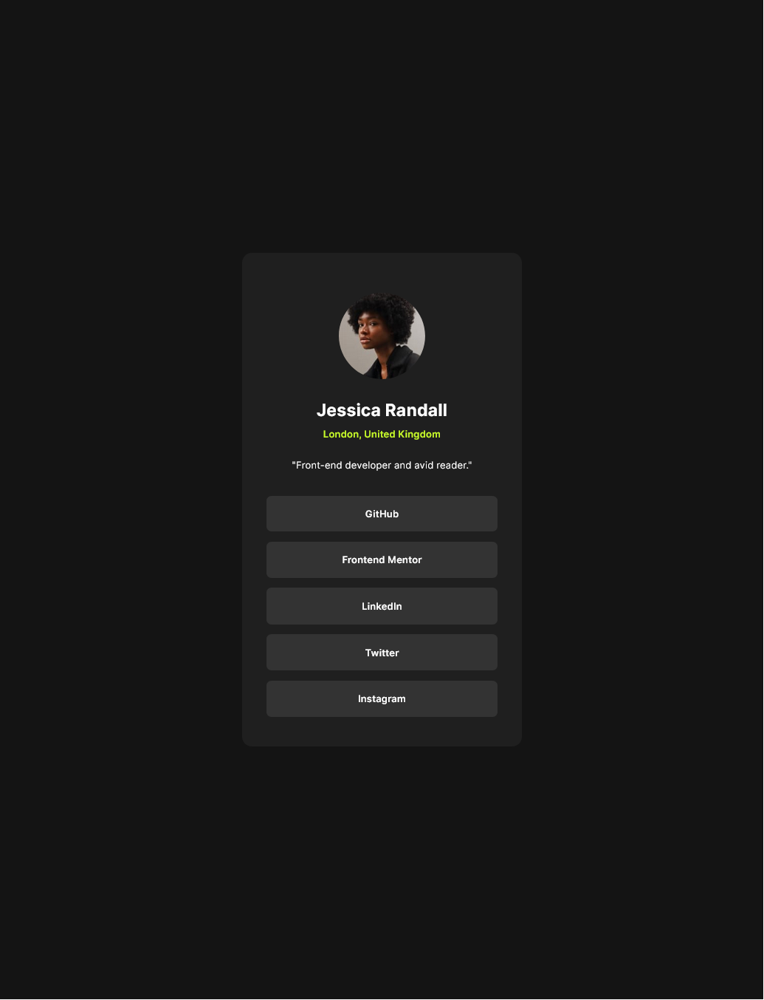

# Frontend Mentor - Social links profile solution

This is a solution to the [Social links profile challenge on Frontend Mentor](https://www.frontendmentor.io/challenges/social-links-profile-UG32l9m6dQ). Frontend Mentor challenges help you improve your coding skills by building realistic projects. 

## Table of contents

- [Overview](#overview)
  - [The challenge](#the-challenge)
  - [Screenshot](#screenshot)
  - [Links](#links)
- [My process](#my-process)
  - [Built with](#built-with)
  - [What I learned](#what-i-learned)
- [Author](#author)

**Note: Delete this note and update the table of contents based on what sections you keep.**

## Overview
Fairly staight forward challenge.  I used this project to focus on using more standard sizing units, rem and percents.
### The challenge
- Follow the style guide
- Make sizing decisions by eye
- Center the card on the screen
- Active and Focus states
- Resizes after 600px width

### Screenshot

### Links
- Live Site URL: [Social Links Site](https://dmsocial.netlify.app/)

## My process
- Started with the structure
- Added CSS variables
- Styled big areas first
- Worked on the smaller areas
- Tweaked padding and margins
- Added the focus and hover states
- Created the mobile breakpoint

### Built with

- Semantic HTML5 markup
- CSS custom properties
- Flexbox

### What I learned

I focused on using rem for padding, margins and font size.  I also added focus styling.

## Author
- Frontend Mentor - [@djmills89](https://www.frontendmentor.io/profile/djmills89)
